Signal tools
============

Pixel correlation 
-----------------

File: `analyze_gpi.py`

Total signal for pixel (30, 30) over part of shot 1150611004:

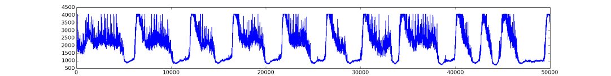

Part analyzed (no big trends):

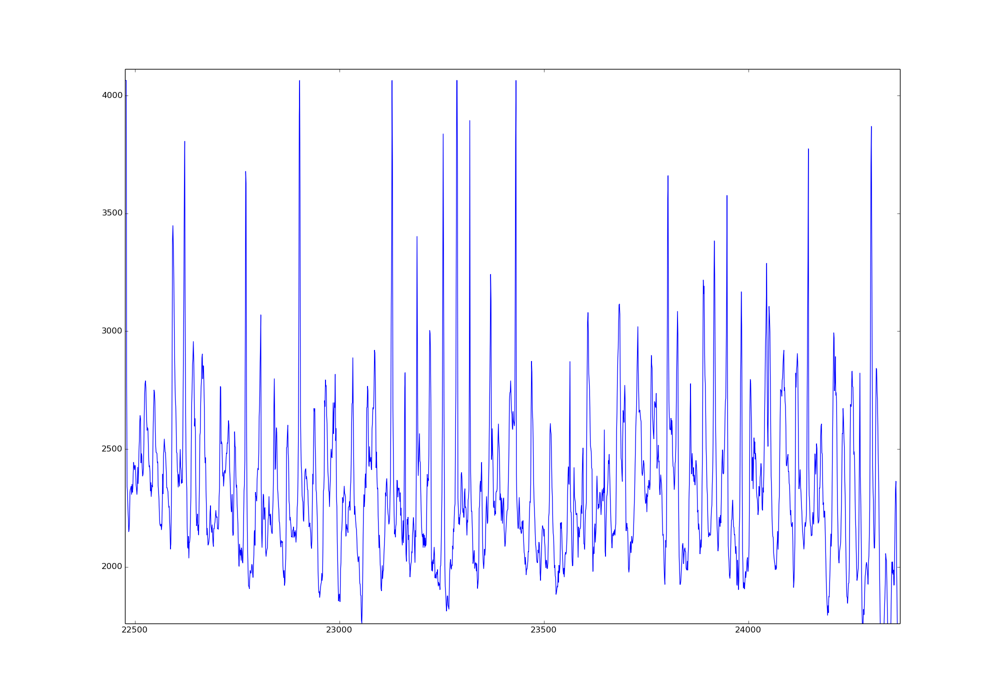

-1 to 1 normalized correlations between 5 pixels over above interval (dashed lines are autocorrelations, all 1.0 at 0 frames lag):

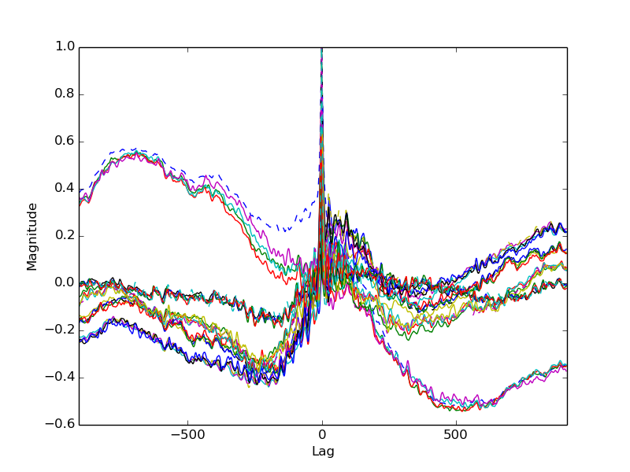

0-lag correlation using Sobel-filtered frames:

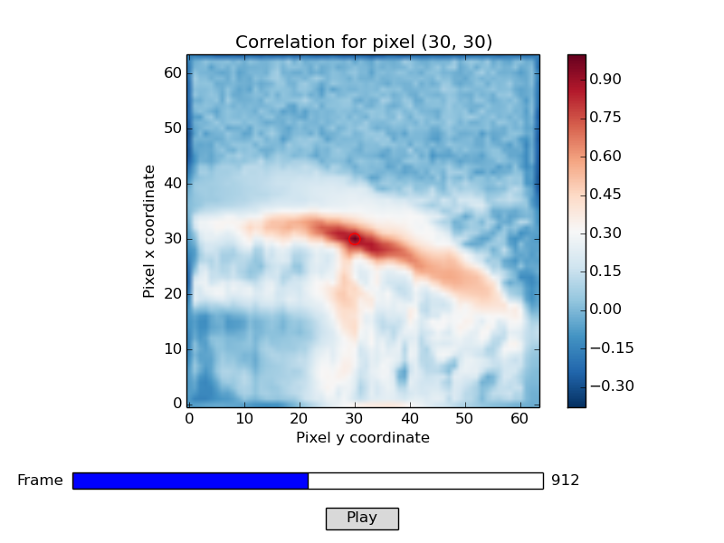

0-lag correlation using 5-frame average subtracted frames:

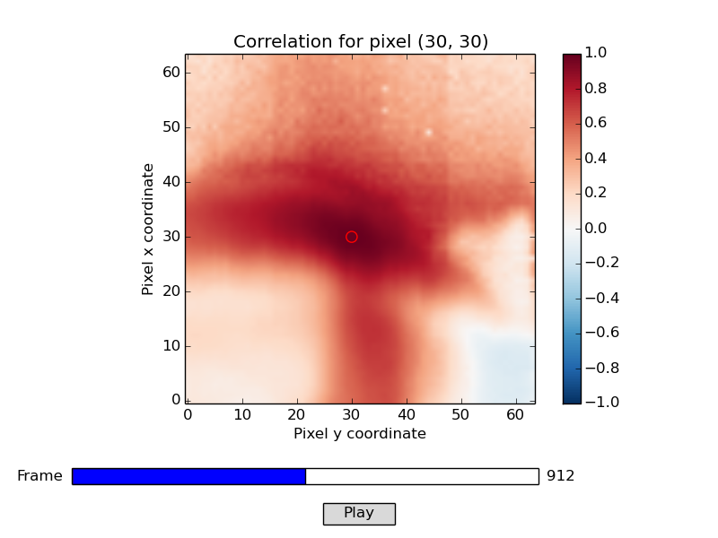

21-frame lag correlation (close to distance between peaks in signal) using 5-frame average subtracted frames:

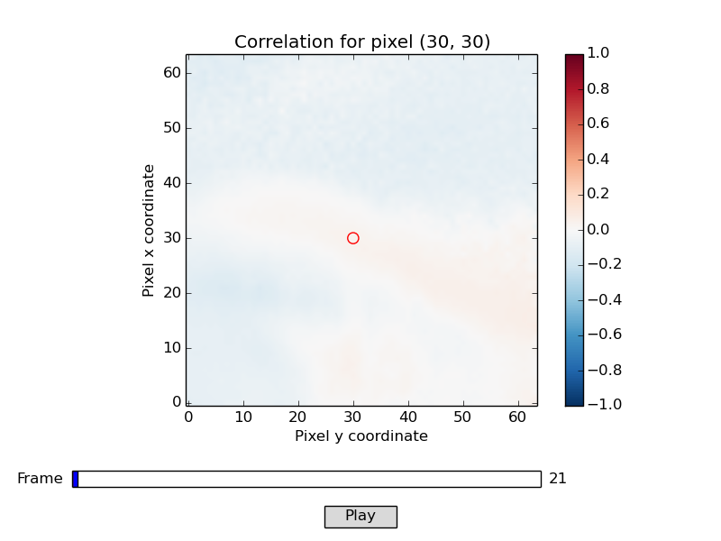

Sobel filter
------------

File: `analyze_gpi.py`

Shown is a Sobel filter applied to the 5-frame average subtracted X-point GPI data for shot 1150611004. 

Geometry
--------

File: `cross_section.py`

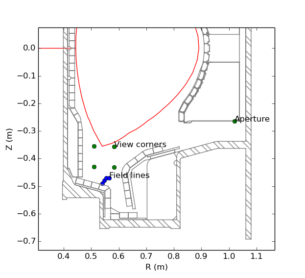

Field lines conjured by IDL code were superimposed by hand on filaments for various frames.

GPI bicoherence
---------------

File: `analyze_gpi.py` using `signals.py` and `bicoherence.py`

Signals analyzed: sums of pixel fluctuations in shot 1150528015 before and after the L-H transition around 0.615 seconds (matching power spectra below).

Before L-H transition, 16 records of length 256:

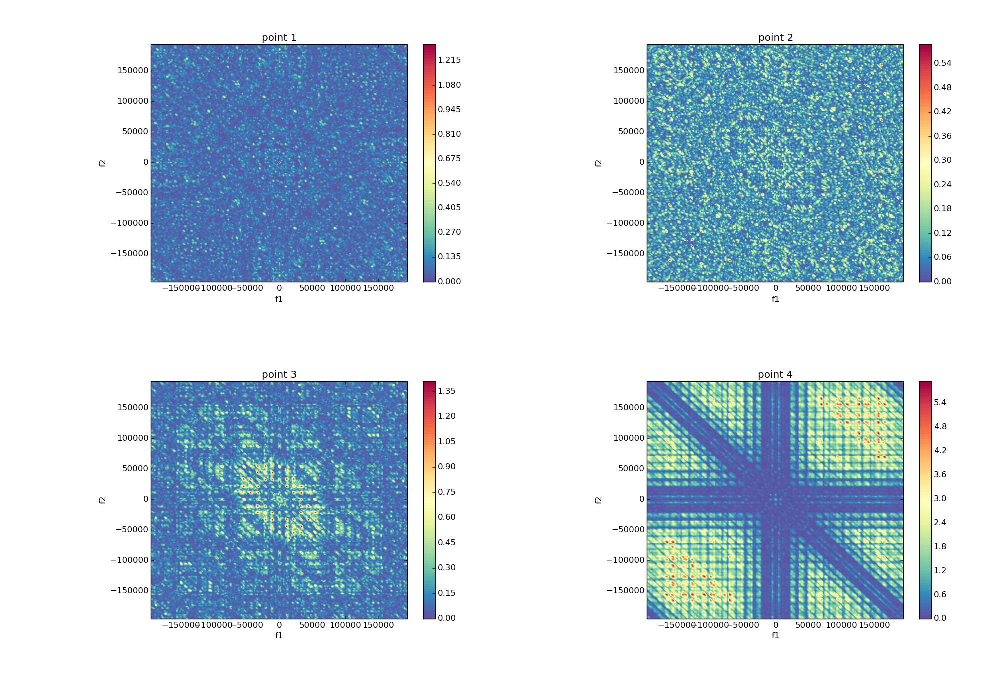

After L-H transition, 16 records of length 256:

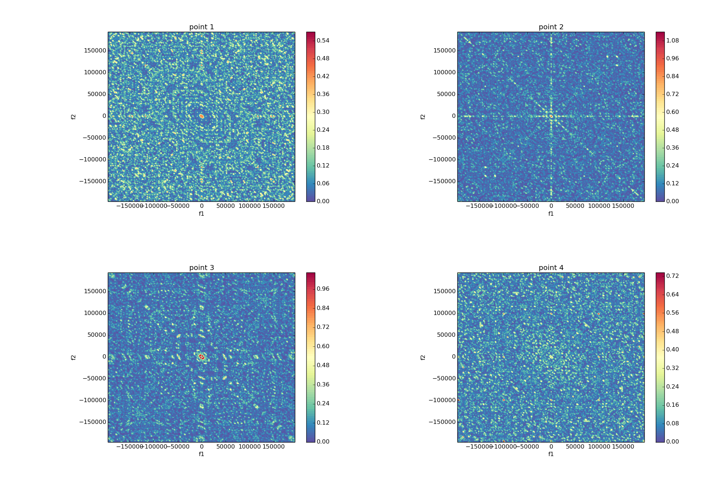

After L-H transition, 64 records of length 256:

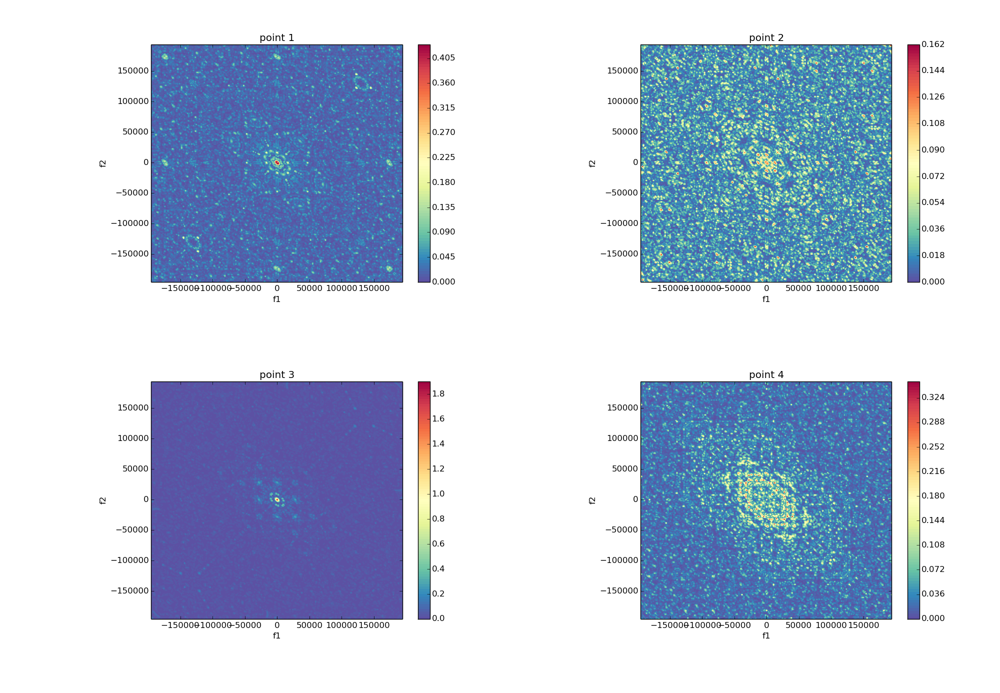

__Danger:__ 
- Tradeoff between number of records to average and resolution of FFT, which is related to the length of each record
- Make sure frequency calculation using time step is correct
- Possibly use `scipy.signal.periodogram` instead of direct FFT and frequency calculations

GPI power spectra
-----------------

File: `analyze_gpi.py` using `signals.py`

Signals analyzed: sums of pixel fluctuations in each red square (fourth is barely visible due to red background) for shot 1150528015, before and after the L-H transition around 0.615 seconds.

Windowed FFT with tiny error bars corresponding to standard error between power spectra for each window. For equal-length portions of the timeseries before and after the L-H transition, around 24 Hanning-weighted windows with 50% overlap were used:

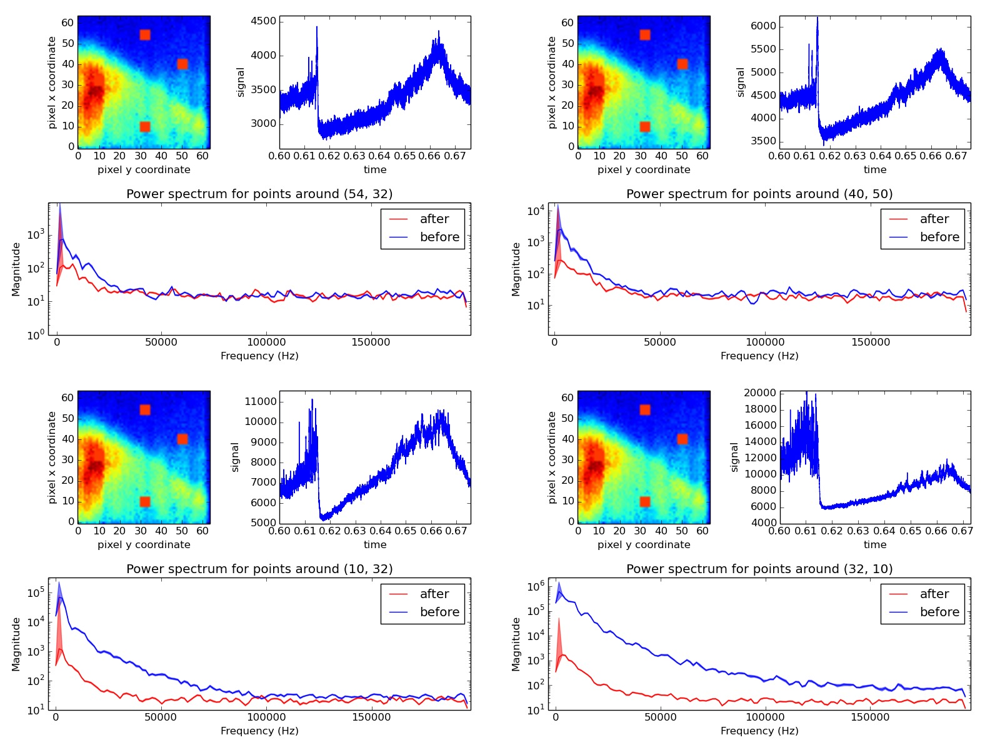

__Less danger:__ 
- Using `scipy.signal.welch` instead of custom windowed FFT code
- Calculations of total power from signal variance and non-windowed power spectrum agree up to 8 decimal places with linear detrend over entire timeseries
- Windowed power spectrum results in significantly different total power (same order of magnitude at least), but is pretty close to result from variance of signal detrended along a similar number of windows

Bicoherence
-----------

Code adapted from [synergetics/spectrum](https://github.com/synergetics/spectrum).

Example data: the quadratic phase coupling problem, a 64x64 array in which each column contains an independent realization (timeseries) of a signal. From the power spectrum we see that there are four waves with frequency .1, .15, .25, and .4 Hz:

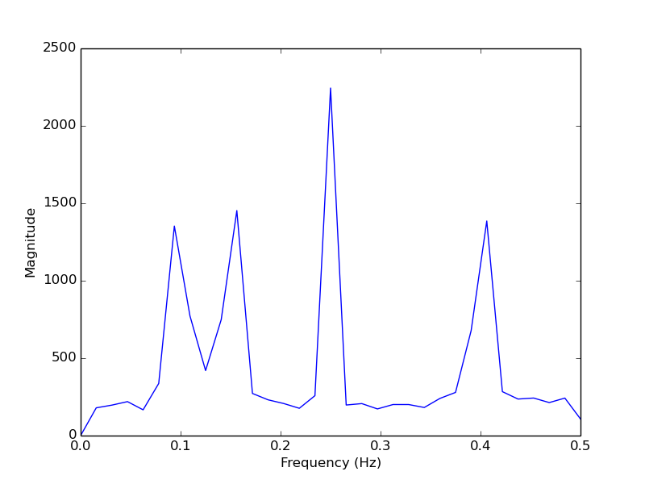

In order to assert that the energy from two waves produces a third, they must be both frequency-coupled (f_1 + f_2 = f_3) and phase-coupled (theta_1 + theta_2 = theta_3). The bicoherence analysis tells us there is frequency- and phase-coupling for all but the wave at .4 Hz, but doesn't say anything about the direction of energy transfer: 

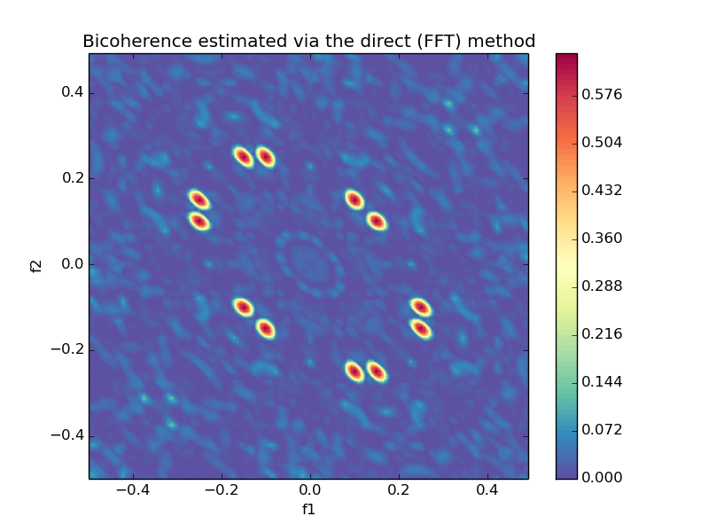

This plot is redundant, and we can get all the information we need (for auto-bicoherence) from the triangle with bottom left corner at (0, 0), top corner at max(f2), and bottom right corner at max(f1).

GPI video viewer
----------------

File: `gpi.py`

View video from specified camera and shot synced to H alpha and line average density timeseries. Overlaid in red is the last closed flux surface:

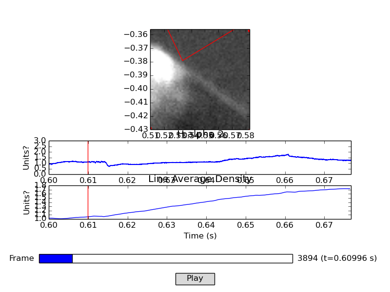

__Danger:__ corner locations depend on focal depth and position, angle of camera, which have yet to be accurately determined.

Other video viewer
------------------

File: `vid_view.py`

View video from any camera for a shot. `raspi2` could be useful for an overview of the x-point, shown here for shot 1150528015:

And a wider view of the same shot:

Total power test
----------------

File: `examples/fourier_ps.py`

Calculations of total power from the power spectrum and the variance of the signal agree:

    1V amplitude sine wave at 300 Hz:
        sqrt of total PS(signal):
            1/N*sqrt(sum(PS(signal)))   =  0.707106781187
        sqrt of variance, rms fluct level, signal:
            sqrt(variance(signal))      =  0.707106781187
    Normally distributed noise:
        sqrt of total PS(signal):
            1/N*sqrt(sum(PS(signal)))   =  1.0014379912
        sqrt of variance, rms fluct level, signal:
            sqrt(variance(signal))      =  1.00143737174
    1V sine wave + noise:
        sqrt of total PS(signal):
            1/N*sqrt(sum(PS(signal)))   =  1.22616075395
        sqrt of variance, rms fluct level, signal:
            sqrt(variance(signal))      =  1.22616024802

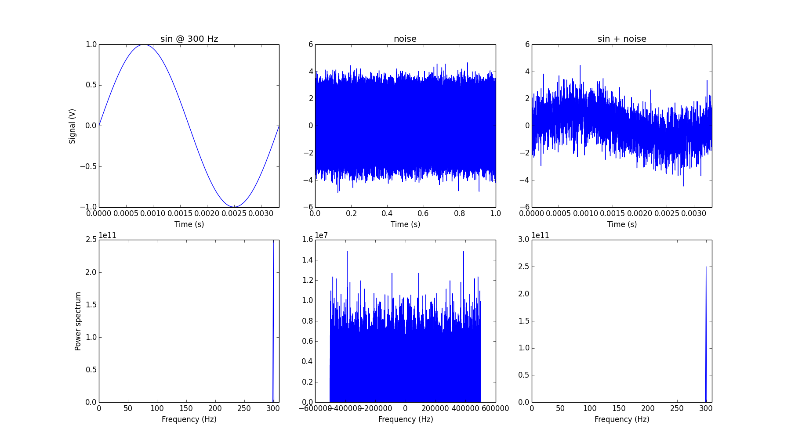

Cross-power spectrum
--------------------

File: `examples/cross_power.py`

Cross-power spectrum of sine waves with frequency 3 and 7 Hz:

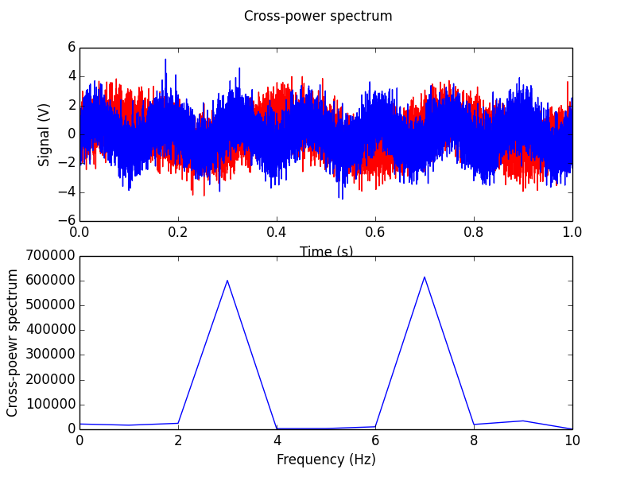

FFT autocorrelation 
-------------------

File: `examples/fft_a_corr.py`

i.e. `autocorrelation = inverse_fft(fft*conjugate(fft))`

Taking the real part:

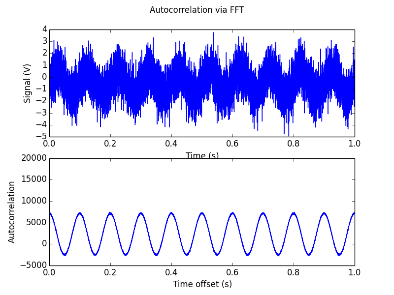

Faster than direct autocorrelation and seems accurate, although not normalized.

Direct autocorrelation 
----------------------

File: `examples/a_corr.py`

Autocorrelation computed directly. Output for `sin(2*pi*10*x) + noise`:

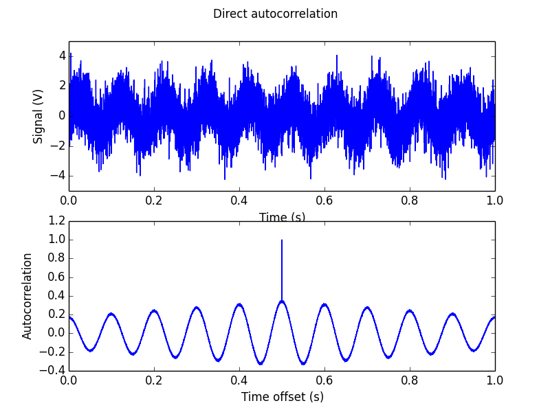

It runs slowly compared to FFT when there are many points in the signal. Also not sure why there is attenuation around the edges.

Power spectrum
--------------

Power spectrum for `sin(2*pi*10.5*x) + sin(2*pi*75.5*x) + noise`. We see wide peaks around 10.5 and 75.5 as expected because the frequency bins are centered at the integers.

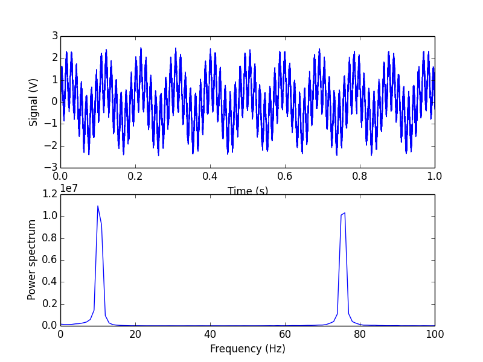
